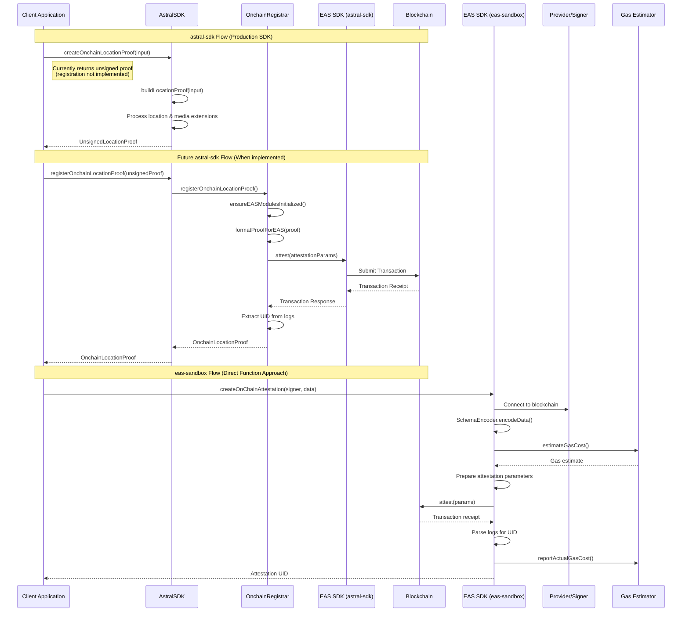
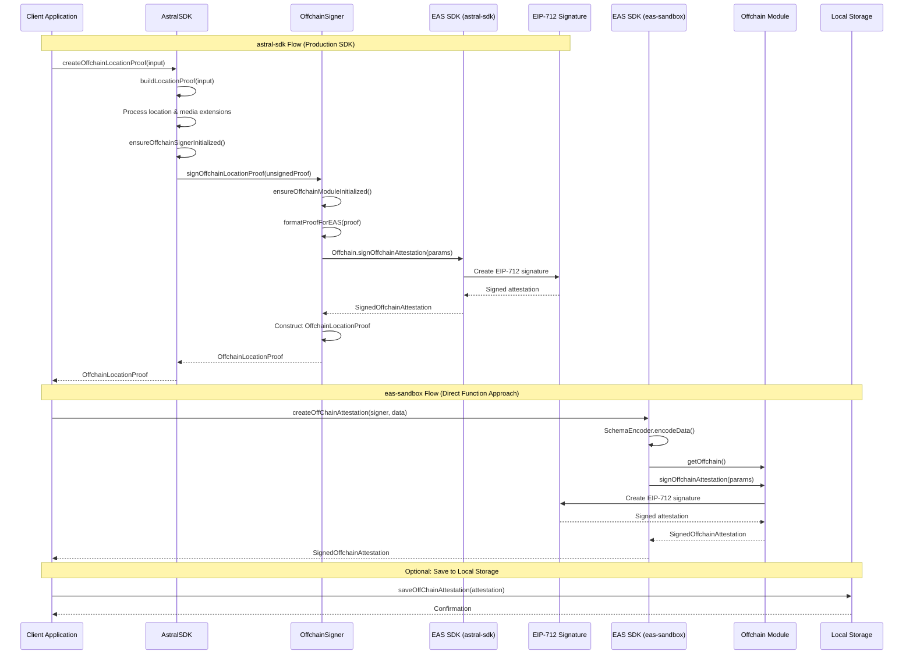
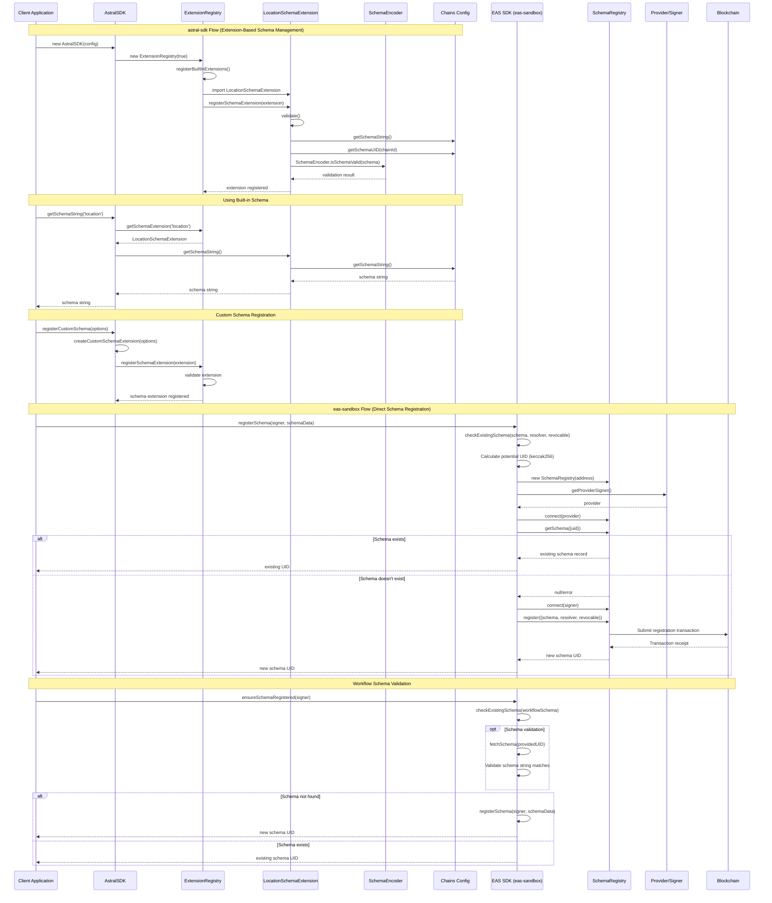

# Codebase comparison: Understanding how to integrate features from `eas-sandbox` into `astral-sdk`

## Onchain Attestations

Onchain attestations and how they are created using the `astral-sdk` and `eas-sandbox` SDKs.

### Notes

#### **astral-sdk (Production SDK Approach)**

**Current State:**

- `createOnchainLocationProof()` currently only builds an unsigned proof and returns it
- The actual on-chain registration is not yet implemented (marked as "placeholder")

**Future Implementation:**

- Will use a clean class-based architecture with `OnchainRegistrar`
- Multi-step process: SDK → OnchainRegistrar → EAS SDK → Blockchain
- Includes proper initialization checks and data formatting specific to location proofs
- Returns a complete `OnchainLocationProof` object with transaction details

#### **eas-sandbox (Direct Function Approach)**

**Current Implementation:**

- `createOnChainAttestation()` provides a complete, working on-chain attestation flow
- Direct function-based approach without intermediate classes
- Includes advanced features like gas estimation and reporting
- More comprehensive error handling and transaction validation
- Returns just the attestation UID

### Architectural Comparison

1. **Abstraction Level:**
   - **astral-sdk**: High-level, domain-specific (location proofs)
   - **eas-sandbox**: Low-level, general-purpose EAS operations

2. **Error Handling:**
   - **astral-sdk**: Custom error classes with detailed context
   - **eas-sandbox**: Try-catch with detailed logging and gas reporting

3. **Data Processing:**
   - **astral-sdk**: Extension system for location/media types
   - **eas-sandbox**: Direct schema encoding with validation helpers

4. **Transaction Management:**
   - **astral-sdk**: Abstracted through OnchainRegistrar class
   - **eas-sandbox**: Direct transaction handling with gas optimization

The diagram clearly shows that while both aim to create on-chain attestations, astral-sdk provides a higher-level, production-ready API focused on location proofs, while eas-sandbox offers more granular control over the EAS attestation process with additional features like gas estimation and detailed transaction reporting.

## Off-chain Attestations

Offchain attestations and how they are created using the `astral-sdk` and `eas-sandbox` SDKs.

### Notes

#### **astral-sdk (Production SDK Approach)**

- **Multi-layered architecture**: Client → AstralSDK → OffchainSigner → EAS SDK → EIP-712
- **Domain-specific processing**: Includes location/media extension processing through `buildLocationProof()`
- **Initialization checks**: Ensures proper setup with `ensureOffchainSignerInitialized()`
- **Data transformation**: Converts location proofs to EAS format via `formatProofForEAS()`
- **Rich output**: Returns a complete `OffchainLocationProof` object with SDK metadata

#### **eas-sandbox (Direct Function Approach)**

- **Streamlined flow**: Direct function call to `createOffChainAttestation()`
- **General-purpose**: Works with any schema data, not specific to location proofs
- **Simple encoding**: Direct schema encoding without domain-specific processing
- **Optional storage**: Includes local storage capabilities for persistence
- **Raw output**: Returns the standard EAS `SignedOffchainAttestation` object

#### Architectural Comparison

Both flows ultimately use EIP-712 signatures through the EAS SDK, but they differ significantly in:

1. **Abstraction Level**: astral-sdk provides high-level location-proof abstractions, while eas-sandbox offers direct EAS operations
2. **Data Processing**: astral-sdk includes sophisticated extension systems for location/media types
3. **Error Handling**: astral-sdk has comprehensive initialization checks and custom error types
4. **Storage**: eas-sandbox includes built-in local storage options; astral-sdk focuses on the signing process
5. **Output Format**: astral-sdk returns domain-specific objects; eas-sandbox returns standard EAS objects

The diagram clearly shows that astral-sdk provides a more production-ready, developer-friendly API for location proofs, while eas-sandbox offers more direct control over EAS attestation processes with additional utility features.

## Schema Creation and Registration

Schema creation and registration workflows in both the `astral-sdk` and `eas-sandbox` SDKs.

### Notes

#### **astral-sdk (Extension-Based Schema Management)**

- **Initialization-time registration**: Schemas are registered as extensions during SDK initialization
- **Built-in schema support**: Comes with pre-configured location schema extensions loaded from config
- **Extension system**: Uses a sophisticated extension registry to manage different schema types
- **Configuration-driven**: Schema strings and UIDs are loaded from `EAS-config.json` files
- **Validation during registration**: Schema extensions validate themselves when being registered
- **Runtime schema access**: Provides methods like `getSchemaString()` and `getSchemaUID()` to access schema information

#### **eas-sandbox (Direct Schema Registration)**

- **On-demand registration**: Schemas are registered directly to the blockchain when needed
- **Existence checking**: Always checks if a schema already exists before attempting registration
- **UID calculation**: Pre-calculates schema UIDs using `keccak256` to avoid duplicate registrations
- **Transaction management**: Handles actual blockchain transactions for schema registration
- **Workflow integration**: Includes `ensureSchemaRegistered()` patterns for workflow-specific schemas
- **Error handling**: Comprehensive error handling for transaction failures and gas issues

### Architectural Philosophy Comparison

1. **Schema as Configuration vs. Schema as Data**:
   - **astral-sdk**: Treats schemas as configuration that's part of the SDK setup
   - **eas-sandbox**: Treats schemas as data that needs to be managed on the blockchain

2. **Abstraction Level**:
   - **astral-sdk**: High-level abstraction with extension system
   - **eas-sandbox**: Direct blockchain interaction with utility functions

3. **Flexibility**:
   - **astral-sdk**: Extensible through custom schema extensions
   - **eas-sandbox**: Flexible through direct function parameters and dynamic registration

4. **Validation**:
   - **astral-sdk**: Validation happens at extension registration time
   - **eas-sandbox**: Validation happens during blockchain interaction
