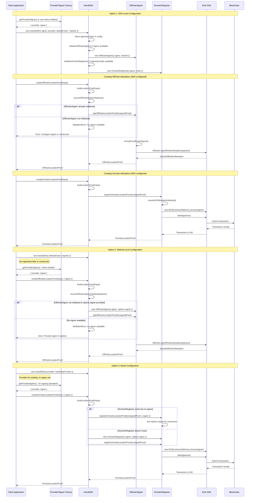

Looking at the astral-sdk implementation, the signer component is handled through a more sophisticated dependency injection pattern compared to the simple approach in the eas-sandbox examples.

## How Signers are Implemented in astral-sdk

The astral-sdk uses a **three-tier signer configuration system**:

### 1. Main SDK Configuration

The `AstralSDK` class accepts a configuration object that can include signer/provider:

```typescript
// AstralSDK constructor accepts config with signer
constructor(config?: AstralSDKConfig) {
  this.config = {
    defaultChain: 'sepolia',
    mode: 'offchain',
    debug: false,
    ...config, // Can include signer, provider, etc.
  };

  // Initialize components if signer/provider available
  if (this.config.signer) {
    this.initializeOffchainSigner();
  }
  if (this.config.provider || this.config.signer) {
    this.initializeOnchainRegistrar();
  }
}
```

### 2. Component-Level Signer Management

The SDK has two main components that handle signers:

**OffchainSigner** - for EIP-712 signatures:

```typescript
export class OffchainSigner {
  private signer?: Signer;

  constructor(config: OffchainSignerConfig) {
    // Validates that either signer or privateKey is provided
    if (!config.signer && !config.privateKey) {
      throw new ValidationError('Either signer or privateKey must be provided');
    }
    this.signer = config.signer as Signer;
  }
}
```

**OnchainRegistrar** - for blockchain transactions:

```typescript
export class OnchainRegistrar {
  private provider?: Provider;
  private signer?: Signer;

  constructor(config: OnchainRegistrarConfig) {
    // Validates that either provider or signer is provided
    if (!config.provider && !config.signer) {
      throw new ValidationError('Either provider or signer must be provided');
    }
    this.provider = config.provider as Provider;
    this.signer = config.signer as Signer;
  }
}
```

### 3. Dynamic Signer Initialization

The SDK can also accept signers at the method level through options:

```typescript
// SDK ensures signer is available before operations
private ensureOffchainSignerInitialized(options?: OffchainProofOptions): void {
  if (!this.offchainSigner) {
    // Try to create one from method options
    if (options && (options.signer || options.privateKey)) {
      this.offchainSigner = new OffchainSigner({
        signer: options.signer,
        privateKey: options.privateKey,
        chainId,
      });
    } else {
      throw new ValidationError('No signer available for offchain operations');
    }
  }
}
```

## Key Differences from eas-sandbox

1. **Configuration vs Direct Creation**: Instead of directly creating `ethers.Wallet` like in the sandbox, the SDK accepts pre-configured signers through config objects

2. **Lazy Initialization**: Signers are only initialized when needed, and can be provided later through method options

3. **Component Separation**: Different components handle different types of signing (offchain EIP-712 vs onchain transactions)

4. **Error Handling**: Comprehensive validation ensures signers are available before attempting operations

5. **Flexibility**: Supports multiple ways to provide signers - through main config, component config, or method options

This design allows the SDK to be more flexible for different use cases while maintaining clear separation of concerns between offchain signing and onchain transaction management.

## Custom AstralSDK Configuration File

Looking at the `AstralSDKConfig` interface and how it's used in the `AstralSDK` class, here's a comprehensive custom config file and documentation:

```json
{
  "defaultChain": "sepolia",
  "mode": "offchain",
  "provider": null,
  "signer": null,
  "apiKey": "your-astral-api-key-here",
  "endpoint": "https://api.astral.xyz",
  "debug": true
}
```

## Complete Configuration Example with All Options

```json
{
  "defaultChain": "sepolia",
  "mode": "offchain",
  "provider": {
    "type": "JsonRpcProvider",
    "url": "https://sepolia.infura.io/v3/YOUR_PROJECT_ID"
  },
  "signer": {
    "type": "Wallet",
    "privateKey": "0xac0974bec39a17e36ba4a6b4d238ff944bacb478cbed5efcae784d7bf4f2ff80"
  },
  "apiKey": "astral_api_key_12345678901234567890",
  "endpoint": "https://api.astral.xyz",
  "debug": true
}
```

## AstralSDKConfig Properties Table

| Property       | Type                                | Required | Default      | Description                                          | Example Value                        |
| -------------- | ----------------------------------- | -------- | ------------ | ---------------------------------------------------- | ------------------------------------ |
| `defaultChain` | `string`                            | ❌       | `"sepolia"`  | The default blockchain network to use for operations | `"sepolia"`, `"celo"`, `"localhost"` |
| `mode`         | `'onchain' \| 'offchain' \| 'ipfs'` | ❌       | `"offchain"` | The primary workflow mode for location proofs        | `"offchain"`, `"onchain"`, `"ipfs"`  |
| `provider`     | `unknown`                           | ❌       | `undefined`  | Ethereum provider instance (ethers.js provider)      | `new ethers.JsonRpcProvider("...")`  |
| `signer`       | `unknown`                           | ❌       | `undefined`  | Ethereum signer instance (ethers.js signer/wallet)   | `new ethers.Wallet("0x...")`         |
| `apiKey`       | `string`                            | ❌       | `undefined`  | API key for Astral services authentication           | `"astral_api_key_12345..."`          |
| `endpoint`     | `string`                            | ❌       | `undefined`  | Base URL for Astral API services                     | `"https://api.astral.xyz"`           |
| `debug`        | `boolean`                           | ❌       | `false`      | Enable debug logging for development                 | `true`, `false`                      |

## Updated Example Usage with Custom Config

```typescript
/**
 * Example: Creating a Location Attestation with Custom Config
 *
 * This example demonstrates how to create a signed offchain location attestation
 * using the Astral SDK with a custom configuration file and EAS config.
 */
/* eslint-disable no-console */

import { ethers } from 'ethers';
import path from 'path';
import fs from 'fs';
import { AstralSDK } from '../src/core/AstralSDK';
import { LocationProofInput, AstralSDKConfig } from '../src/core/types';
import { loadEASConfig, getChainConfigByName, getSchemaUID } from '../src/eas/chains';

async function main() {
  try {
    console.log('Creating a signed location attestation with custom configurations\n');

    // Load custom AstralSDK configuration
    const sdkConfigPath = path.resolve(__dirname, 'custom-sdk-config.json');
    let sdkConfig: AstralSDKConfig = {};

    if (fs.existsSync(sdkConfigPath)) {
      const configData = fs.readFileSync(sdkConfigPath, 'utf-8');
      sdkConfig = JSON.parse(configData);
      console.log(`Loaded AstralSDK config from: ${sdkConfigPath}`);
    } else {
      console.log('Using default AstralSDK configuration');
    }

    // Load custom EAS configuration
    const easConfigPath = path.resolve(__dirname, 'custom-eas-config.json');
    let easConfig;
    let chainConfig;
    let schemaUID;

    if (fs.existsSync(easConfigPath)) {
      easConfig = loadEASConfig(easConfigPath);
      chainConfig = getChainConfigByName(sdkConfig.defaultChain || 'sepolia');
      schemaUID = getSchemaUID(sdkConfig.defaultChain || 'sepolia');
      console.log(`Loaded EAS config from: ${easConfigPath}`);
    } else {
      console.log('Using default EAS configuration');
    }

    // Create wallet (override config if needed)
    const wallet = new ethers.Wallet(
      '0xac0974bec39a17e36ba4a6b4d238ff944bacb478cbed5efcae784d7bf4f2ff80'
    );
    console.log(`Using wallet address: ${wallet.address}`);

    // Create provider if we have chain config
    let provider;
    if (chainConfig?.rpcUrl) {
      provider = new ethers.JsonRpcProvider(chainConfig.rpcUrl);
      console.log(`Using RPC URL from EAS config: ${chainConfig.rpcUrl}`);
    } else if (sdkConfig.provider) {
      provider = sdkConfig.provider;
      console.log('Using provider from SDK config');
    }

    // Connect wallet to provider if available
    const connectedWallet = provider ? wallet.connect(provider) : wallet;

    // Merge configurations - SDK config takes precedence, but we can override
    const finalConfig: AstralSDKConfig = {
      ...sdkConfig,
      signer: connectedWallet, // Always use our wallet
      provider: provider || sdkConfig.provider,
    };

    console.log('\nFinal SDK Configuration:');
    console.log('- Default Chain:', finalConfig.defaultChain);
    console.log('- Mode:', finalConfig.mode);
    console.log('- Debug:', finalConfig.debug);
    console.log('- API Key:', finalConfig.apiKey ? '[REDACTED]' : 'Not set');
    console.log('- Endpoint:', finalConfig.endpoint);

    if (chainConfig) {
      console.log('\nEAS Configuration:');
      console.log('- Contract Address:', chainConfig.easContractAddress);
      console.log('- Schema UID:', schemaUID);
      console.log('- RPC URL:', chainConfig.rpcUrl);
      console.log('- Deployment Block:', chainConfig.deploymentBlock);
    }

    // Initialize the AstralSDK with merged configuration
    const sdk = new AstralSDK(finalConfig);

    // Create location proof input with GeoJSON data
    const locationInput: LocationProofInput = {
      location: {
        type: 'Point',
        coordinates: [-122.4194, 37.7749], // San Francisco coordinates
      },
      locationType: 'geojson',
      memo: 'Example location attestation with custom configurations',
      timestamp: new Date(),
    };

    console.log('\nLocation input:', locationInput);

    // Create and sign an offchain location proof
    console.log('\nCreating and signing the location proof...');
    const offchainProof = await sdk.createOffchainLocationProof(locationInput);

    console.log('\nOffchain attestation created successfully!');
    console.log('UID:', offchainProof.uid);
    console.log('Signer:', offchainProof.signer);
    console.log('Version:', offchainProof.version);
    console.log(
      'Signature (truncated):',
      typeof offchainProof.signature === 'string'
        ? offchainProof.signature.substring(0, 64) + '...'
        : 'Non-string signature'
    );

    // Verify the signed proof
    console.log('\nVerifying the attestation...');
    const verificationResult = await sdk.verifyOffchainLocationProof(offchainProof);

    if (verificationResult.isValid) {
      console.log('✅ Attestation verified successfully!');
      console.log('Verified signer address:', verificationResult.signerAddress);
    } else {
      console.error('❌ Attestation verification failed:', verificationResult.reason);
    }

    return offchainProof;
  } catch (error) {
    console.error('Error creating location attestation:', error);
    throw error;
  }
}

// Run the example
main()
  .then(proof => {
    console.log('\nComplete location attestation:');
    const displayProof = {
      ...proof,
      location: JSON.parse(proof.location),
    };
    console.log(JSON.stringify(displayProof, null, 2));
    console.log('\nAttestation created with custom configurations.');
  })
  .catch(error => {
    console.error('Example failed:', error);
    process.exit(1);
  });
```

## Sample Configuration Files

### 1. Development Config (`examples/custom-sdk-config.json`)

```json
{
  "defaultChain": "sepolia",
  "mode": "offchain",
  "debug": true,
  "apiKey": "dev_api_key_placeholder",
  "endpoint": "https://dev-api.astral.xyz"
}
```

### 2. Production Config (`examples/custom-sdk-config-prod.json`)

```json
{
  "defaultChain": "celo",
  "mode": "onchain",
  "debug": false,
  "apiKey": "prod_api_key_placeholder",
  "endpoint": "https://api.astral.xyz"
}
```

### 3. Local Development Config (`examples/custom-sdk-config-local.json`)

```json
{
  "defaultChain": "localhost",
  "mode": "offchain",
  "debug": true,
  "endpoint": "http://localhost:3000"
}
```

## Environment Variable Integration

You can also combine this with environment variables for sensitive data:

```typescript
// Load config and merge with environment variables
const configData = JSON.parse(fs.readFileSync(sdkConfigPath, 'utf-8'));
const finalConfig: AstralSDKConfig = {
  ...configData,
  apiKey: process.env.ASTRAL_API_KEY || configData.apiKey,
  endpoint: process.env.ASTRAL_ENDPOINT || configData.endpoint,
  defaultChain: process.env.DEFAULT_CHAIN || configData.defaultChain,
  debug: process.env.DEBUG === 'true' || configData.debug,
};
```

This approach gives you maximum flexibility to:

- Use different configurations for different environments
- Override sensitive values with environment variables
- Combine AstralSDK config with EAS config seamlessly
- Maintain clean separation between configuration and code

## Signer and Provider Configuration in AstralSDK

How signer and provider values flow through the AstralSDK for creating onchain and offchain attestations.



### Key Signer/Provider Configuration Patterns

#### **1. SDK-Level Configuration (Recommended for Production)**

```typescript
// eas-sandbox style provider creation
const { provider, signer } = getProviderSigner();

// astral-sdk initialization with signer
const sdk = new AstralSDK({
  signer,
  provider, // optional if signer has provider
  defaultChain: 'sepolia',
  debug: true,
});

// Components are pre-initialized, ready for use
const offchainProof = await sdk.createOffchainLocationProof(input);
const onchainProof = await sdk.createOnchainLocationProof(input);
```

#### **2. Method-Level Configuration (Flexible for Multi-Signer Scenarios)**

```typescript
// SDK without signer
const sdk = new AstralSDK({
  defaultChain: 'sepolia',
});

// Different signers for different operations
const { signer: userSigner } = getProviderSigner();
const { signer: adminSigner } = getAdminProviderSigner();

// User creates offchain proof
const offchainProof = await sdk.createOffchainLocationProof(input, {
  signer: userSigner,
});

// Admin creates onchain proof
const onchainProof = await sdk.createOnchainLocationProof(input, {
  signer: adminSigner,
  txOverrides: { gasLimit: 500000 },
});
```

#### **3. Mixed Configuration (Provider for Reading, Signer for Transactions)**

```typescript
// Read-only provider for queries
const readOnlyProvider = new ethers.JsonRpcProvider(rpcUrl);

const sdk = new AstralSDK({
  provider: readOnlyProvider,
  defaultChain: 'sepolia',
});

// Signer only when needed for transactions
const { signer } = getProviderSigner();

const onchainProof = await sdk.createOnchainLocationProof(input, {
  signer, // Provided at method level
});
```

### Configuration Validation Flow

#### **Offchain Operations (EIP-712 Signing)**

1. **SDK Check**: `ensureOffchainSignerInitialized(options?)`
2. **Fallback Creation**: If no signer in config, try `options.signer`
3. **Validation**: Ensure signer can sign (has private key access)
4. **Chain ID**: Extract from signer or provider for EIP-712 domain

#### **Onchain Operations (Blockchain Transactions)**

1. **SDK Check**: Validate signer or provider availability
2. **Component Creation**: Initialize `OnchainRegistrar` if needed
3. **Gas Estimation**: Use provider for gas calculation (if available)
4. **Transaction**: Use signer for actual blockchain submission
5. **Chain Detection**: Auto-detect chain from provider/signer

### Error Handling Patterns

```typescript
// SDK-level validation
if (!this.config.signer && (!options || !options.signer)) {
  throw new ValidationError(
    'No signer available for onchain operations. Provide signer in SDK constructor or options.',
    undefined,
    { config: this.config, options }
  );
}

// Component-level validation
if (!config.signer && !config.privateKey) {
  throw new ValidationError('Either signer or privateKey must be provided for OffchainSigner');
}

// Chain connection validation
if (!this.signer?.provider) {
  throw new ChainConnectionError('Signer must be connected to a provider for onchain operations');
}
```

This diagram illustrates how astral-sdk provides maximum flexibility for signer/provider configuration while maintaining clear validation and error handling patterns. The SDK supports both the simple direct approach used in eas-sandbox examples and more sophisticated production scenarios with multiple signers and providers.
